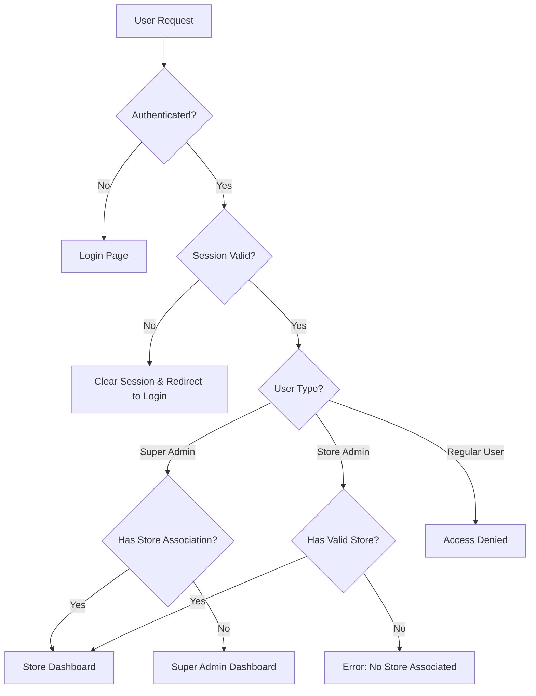

# Design Document

## Overview

This design addresses the authentication and redirect loop issues in the Django application by restructuring the authentication flow, fixing middleware logic, improving session management, and implementing proper error handling. The solution focuses on creating a clear, predictable authentication system that handles different user types (super admins and store admins) without conflicts.

## Architecture

### Current Issues Analysis

1. **Redirect Loop Problem**: The middleware and views create circular redirects between `/dashboard/` and `/login/`
2. **Session Management**: The `SessaoUnicaMiddleware` has logic flaws that cause authentication failures
3. **URL Conflicts**: Multiple login endpoints and unclear routing priorities
4. **Error Handling**: 500 errors in store dashboard due to missing error handling
5. **User Type Confusion**: Unclear logic for determining appropriate dashboards for different user types

### Proposed Architecture



## Components and Interfaces

### 1. Enhanced Authentication Middleware

**Purpose**: Replace the problematic `SessaoUnicaMiddleware` with a more robust solution.

**Key Changes**:
- Implement proper session validation without causing loops
- Add redirect loop detection and prevention
- Improve error handling for edge cases
- Separate session management from authentication logic

**Interface**:
```python
class ImprovedAuthenticationMiddleware:
    def __init__(self, get_response)
    def __call__(self, request)
    def is_excluded_path(self, path) -> bool
    def validate_session(self, request) -> bool
    def handle_invalid_session(self, request) -> HttpResponse
    def detect_redirect_loop(self, request) -> bool
```

### 2. Centralized Authentication Service

**Purpose**: Provide a single point of truth for authentication decisions.

**Interface**:
```python
class AuthenticationService:
    @staticmethod
    def determine_user_dashboard(user) -> str
    @staticmethod
    def can_access_store_dashboard(user, store=None) -> bool
    @staticmethod
    def get_user_store(user) -> Optional[Loja]
    @staticmethod
    def validate_user_permissions(user, required_permission) -> bool
```

### 3. Improved Dashboard Views

**Purpose**: Consolidate dashboard logic and improve error handling.

**Key Changes**:
- Single entry point for dashboard access
- Proper error handling for missing store associations
- Clear user type determination
- Consistent redirect patterns

### 4. Session Management Service

**Purpose**: Handle session creation, validation, and cleanup.

**Interface**:
```python
class SessionService:
    @staticmethod
    def create_user_session(request, user) -> bool
    @staticmethod
    def validate_session(request) -> bool
    @staticmethod
    def invalidate_user_sessions(user, exclude_current=True)
    @staticmethod
    def cleanup_expired_sessions()
```

## Data Models

### Enhanced SessaoAtiva Model

**Changes**:
- Add redirect loop detection fields
- Improve session validation logic
- Add better error tracking

```python
class SessaoAtiva(models.Model):
    # Existing fields...
    redirect_count = models.IntegerField(default=0)
    last_redirect_url = models.CharField(max_length=255, blank=True)
    error_count = models.IntegerField(default=0)
    last_error = models.TextField(blank=True)
```

### User Profile Extensions

**Purpose**: Better track user authentication state and preferences.

```python
class PerfilUsuario(models.Model):
    # Existing fields...
    preferred_dashboard = models.CharField(max_length=50, blank=True)
    login_attempts = models.IntegerField(default=0)
    last_login_error = models.TextField(blank=True)
```

## Error Handling

### 1. Redirect Loop Prevention

**Strategy**:
- Track redirect count per session
- Implement maximum redirect limit (default: 3)
- Break loops by forcing logout and clear error message

### 2. Session Validation Errors

**Strategy**:
- Graceful degradation when session validation fails
- Clear user feedback about session issues
- Automatic cleanup of invalid sessions

### 3. Store Access Errors

**Strategy**:
- Proper 404 handling for missing stores
- Clear error messages for permission issues
- Fallback dashboards for users without store access

### 4. Database Connection Issues

**Strategy**:
- Retry logic for temporary database issues
- Fallback authentication when session management fails
- Comprehensive logging for debugging

## Testing Strategy

### 1. Unit Tests

**Coverage Areas**:
- Authentication service methods
- Session management functions
- Middleware logic paths
- User type determination

### 2. Integration Tests

**Scenarios**:
- Complete authentication flows
- Redirect behavior testing
- Session lifecycle management
- Error condition handling

### 3. End-to-End Tests

**User Journeys**:
- Super admin login and dashboard access
- Store admin login and store dashboard access
- Invalid user handling
- Session timeout scenarios

### 4. Load Testing

**Focus Areas**:
- Session management under load
- Concurrent user authentication
- Database performance during peak usage

## Security Considerations

### 1. Session Security

- Implement proper session rotation
- Add CSRF protection for authentication forms
- Secure session cookie configuration
- Session timeout management

### 2. Access Control

- Principle of least privilege
- Clear permission boundaries
- Audit logging for sensitive operations
- Rate limiting for login attempts

### 3. Data Protection

- Secure handling of authentication credentials
- Proper error message sanitization
- Protection against timing attacks
- Secure redirect validation

## Performance Optimizations

### 1. Database Queries

- Optimize session validation queries
- Implement proper indexing for authentication tables
- Use select_related for user-store relationships
- Cache frequently accessed user permissions

### 2. Middleware Efficiency

- Minimize database calls in middleware
- Implement smart caching for session validation
- Optimize excluded path checking
- Reduce redundant authentication checks

### 3. Session Management

- Efficient session cleanup processes
- Batch operations for session invalidation
- Optimized session storage configuration
- Proper session garbage collection

## Migration Strategy

### Phase 1: Middleware Replacement
1. Create new authentication middleware
2. Test in parallel with existing middleware
3. Gradual rollout with feature flags
4. Monitor for issues and rollback capability

### Phase 2: View Consolidation
1. Refactor dashboard views
2. Implement centralized authentication service
3. Update URL patterns
4. Test all user flows

### Phase 3: Session Management
1. Deploy enhanced session management
2. Migrate existing sessions
3. Implement cleanup processes
4. Monitor performance impact

### Phase 4: Error Handling
1. Implement comprehensive error handling
2. Add monitoring and alerting
3. Update user-facing error messages
4. Document troubleshooting procedures