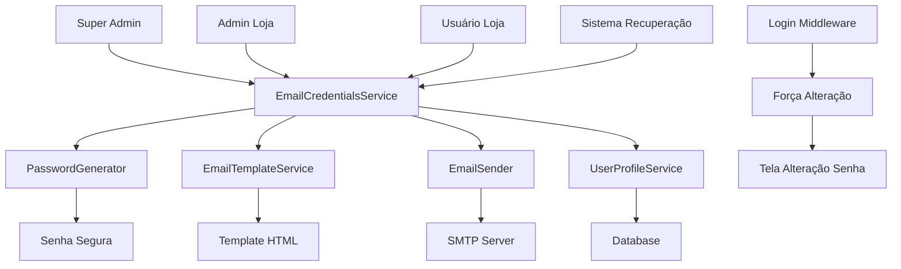
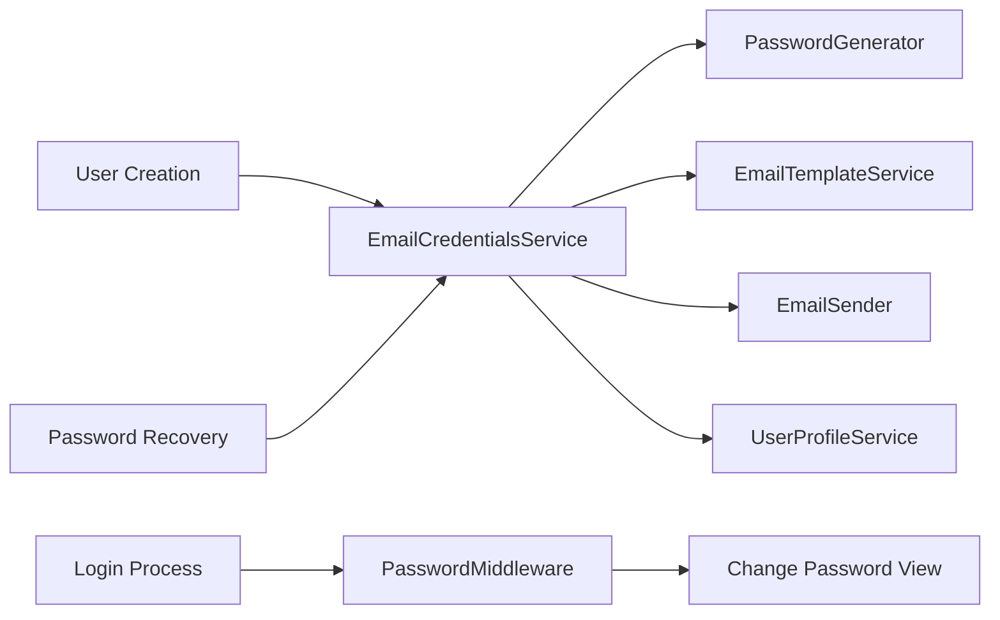

# Design Document

## Overview

Este documento detalha o design técnico para padronizar o sistema de envio de senhas provisórias por email em todo o sistema LVK. A solução implementará um serviço centralizado que será usado por todos os módulos, garantindo consistência e reutilização de código.

## Architecture

### High-Level Architecture



### Component Architecture



## Components and Interfaces

### 1. EmailCredentialsService (Core Service)

**Responsabilidade:** Coordenar todo o processo de criação e envio de credenciais

```python
class EmailCredentialsService:
    def send_credentials(self, user, user_type, context=None):
        """
        Envia credenciais por email para qualquer tipo de usuário
        
        Args:
            user: Instância do User
            user_type: 'super_admin', 'loja_admin', 'loja_user'
            context: {
                'loja': Loja instance (para loja_admin e loja_user),
                'access_profile': perfil de acesso dentro da loja,
                'created_by': usuário que criou (admin da loja)
            }
        """
        
    def generate_and_send_recovery(self, email_or_username):
        """
        Gera nova senha provisória e envia por email
        """
        
    def resend_credentials(self, user):
        """
        Reenvia credenciais para usuário existente
        """
```

### 2. PasswordGenerator (Utility)

**Responsabilidade:** Gerar senhas seguras e únicas

```python
class PasswordGenerator:
    @staticmethod
    def generate_secure_password(length=12):
        """
        Gera senha segura com:
        - Mínimo 12 caracteres
        - Letras maiúsculas, minúsculas, números
        - Caracteres especiais opcionais
        """
        
    @staticmethod
    def is_password_strong(password):
        """
        Valida força da senha
        """
```

### 3. EmailTemplateService (Template Engine)

**Responsabilidade:** Gerenciar templates de email personalizados

```python
class EmailTemplateService:
    def get_template(self, user_type, loja_type=None):
        """
        Retorna template apropriado baseado no tipo de usuário e loja
        """
        
    def render_template(self, template, context):
        """
        Renderiza template com dados do contexto
        """
        
    TEMPLATES = {
        'super_admin': 'emails/credentials_super_admin.html',
        'loja_admin': 'emails/credentials_loja_admin.html',
        'loja_user': 'emails/credentials_loja_user.html',
        'recovery': 'emails/password_recovery.html'
    }
```

### 4. EmailSender (Communication)

**Responsabilidade:** Enviar emails com tratamento de erros

```python
class EmailSender:
    def send_email(self, to_email, subject, html_content, fallback_text=None):
        """
        Envia email com tratamento robusto de erros
        """
        
    def log_email_attempt(self, to_email, success, error=None):
        """
        Registra tentativas de envio para auditoria
        """
```

### 5. UserProfileService (Data Management)

**Responsabilidade:** Gerenciar perfis de usuário e controle de senhas

```python
class UserProfileService:
    def mark_password_as_provisional(self, user):
        """
        Marca senha como provisória
        """
        
    def mark_password_as_permanent(self, user):
        """
        Marca senha como definitiva após alteração
        """
        
    def requires_password_change(self, user):
        """
        Verifica se usuário precisa alterar senha
        """
```

### 6. PasswordRecoveryMiddleware (Security)

**Responsabilidade:** Forçar alteração de senha provisória

```python
class PasswordRecoveryMiddleware:
    def __call__(self, request):
        """
        Intercepta requests e força alteração de senha se necessário
        """

### 7. DatabaseRouter (Multi-Database Management)

**Responsabilidade:** Rotear queries para banco correto baseado na loja

```python
class LojasDatabaseRouter:
    def db_for_read(self, model, **hints):
        """
        Determina qual banco usar para leitura baseado no usuário/loja
        - Banco principal: User, ExtendedUserProfile, Loja
        - Banco da loja: Todos os outros modelos específicos da loja
        """
        
    def db_for_write(self, model, **hints):
        """
        Determina qual banco usar para escrita baseado no usuário/loja
        """
        
    def allow_migrate(self, db, app_label, model_name=None, **hints):
        """
        Controla quais migrações aplicar em cada banco:
        - Banco principal: apenas modelos de controle
        - Bancos das lojas: modelos específicos de cada loja
        """
        
    def get_loja_database(self, loja_id):
        """
        Retorna alias do banco individual da loja
        """
        return f"loja_{loja_id}"
```

## Data Models

### Extended User Profile (Banco Principal)

```python
class ExtendedUserProfile(models.Model):
    """
    Perfil no banco principal - apenas para controle de acesso
    Dados específicos ficam no banco individual da loja
    """
    user = models.OneToOneField(User, on_delete=models.CASCADE)
    
    # Controle de senha
    has_provisional_password = models.BooleanField(default=False)
    provisional_password_created = models.DateTimeField(null=True)
    password_changed_at = models.DateTimeField(null=True)
    
    # Contexto do usuário
    user_type = models.CharField(max_length=20, choices=USER_TYPE_CHOICES)
    # super_admin, loja_admin, loja_user
    
    # Associação com loja (para roteamento de banco)
    associated_loja = models.ForeignKey('lojas.Loja', null=True, blank=True)
    # Define qual banco individual usar
    
    # Configuração de banco individual
    database_alias = models.CharField(max_length=50, blank=True)
    # Nome do banco individual da loja
    
    # Auditoria
    created_by = models.ForeignKey(User, related_name='created_users', null=True)
    last_login_attempt = models.DateTimeField(null=True)

### Loja User Profile (Banco Individual da Loja)

```python
class LojaUserProfile(models.Model):
    """
    Perfil específico no banco individual da loja
    Contém dados detalhados do usuário
    """
    user_id = models.IntegerField(unique=True)  # Referência ao User do banco principal
    username = models.CharField(max_length=150, unique=True)
    
    # Perfil de acesso dentro da loja
    loja_access_profile = models.CharField(max_length=50)
    # Ex: 'secretaria', 'coordenacao', 'professor' para FATESA
    # Ex: 'vendedor', 'gerente', 'caixa' para conveniência
    
    # Dados específicos da loja
    permissions = models.JSONField(default=dict)
    settings = models.JSONField(default=dict)
    
    # Auditoria no banco da loja
    created_at = models.DateTimeField(auto_now_add=True)
    updated_at = models.DateTimeField(auto_now=True)
```

### Email Log

```python
class EmailLog(models.Model):
    user = models.ForeignKey(User, on_delete=models.CASCADE)
    email_type = models.CharField(max_length=20)  # 'credentials', 'recovery'
    to_email = models.EmailField()
    subject = models.CharField(max_length=200)
    sent_at = models.DateTimeField(auto_now_add=True)
    success = models.BooleanField()
    error_message = models.TextField(blank=True)
    ip_address = models.GenericIPAddressField(null=True)
```

## Error Handling

### Error Handling Strategy

```python
class EmailCredentialsError(Exception):
    """Base exception for email credentials system"""
    pass

class EmailSendError(EmailCredentialsError):
    """Raised when email sending fails"""
    pass

class PasswordGenerationError(EmailCredentialsError):
    """Raised when password generation fails"""
    pass

class UserNotFoundError(EmailCredentialsError):
    """Raised when user is not found for recovery"""
    pass
```

### Fallback Mechanisms

1. **Email Failure Fallback:**
   - Log error
   - Show credentials on screen
   - Create notification for admin
   - Allow manual resend

2. **Template Missing Fallback:**
   - Use default template
   - Log warning
   - Continue with basic template

3. **Password Generation Failure:**
   - Retry with different algorithm
   - Use backup generator
   - Log critical error

## Testing Strategy

### Unit Tests

```python
class TestEmailCredentialsService:
    def test_send_credentials_super_admin(self):
        """Test sending credentials to super admin"""
        
    def test_send_credentials_loja_admin(self):
        """Test sending credentials to loja admin"""
        
    def test_send_credentials_loja_user(self):
        """Test sending credentials to loja user"""
        
    def test_password_recovery_flow(self):
        """Test complete password recovery flow"""
        
    def test_email_failure_fallback(self):
        """Test fallback when email fails"""
```

### Integration Tests

```python
class TestPasswordRecoveryIntegration:
    def test_forgot_password_flow(self):
        """Test complete forgot password flow"""
        
    def test_first_login_password_change(self):
        """Test forced password change on first login"""
        
    def test_multiple_loja_types(self):
        """Test with different loja types"""
```

### Performance Tests

- Email sending performance under load
- Template rendering performance
- Database query optimization
- Middleware performance impact

## Security Considerations

### Password Security

1. **Generation:**
   - Minimum 12 characters
   - Cryptographically secure random
   - No dictionary words
   - Unique per user

2. **Storage:**
   - Hashed with Django's default hasher
   - No plaintext storage
   - Secure transmission only

3. **Expiration:**
   - Provisional passwords expire after 30 days
   - Force change on first login
   - Log all password changes

### Email Security

1. **Content:**
   - No sensitive data in subject
   - Encrypted transmission (TLS)
   - Minimal credential exposure

2. **Delivery:**
   - Rate limiting for recovery requests
   - IP tracking for abuse prevention
   - Audit trail for all emails

### Access Control

1. **Recovery Limits:**
   - Max 3 recovery attempts per hour
   - Account lockout after excessive attempts
   - Admin notification for suspicious activity

2. **Middleware Security:**
   - Secure redirect handling
   - CSRF protection
   - Session security

## Configuration

### Settings Structure

```python
# settings.py
EMAIL_CREDENTIALS_CONFIG = {
    'ENABLED': True,
    'FALLBACK_TO_SCREEN': True,
    'PASSWORD_LENGTH': 12,
    'PASSWORD_EXPIRY_DAYS': 30,
    'RECOVERY_RATE_LIMIT': 3,  # per hour
    'TEMPLATES': {
        'super_admin': 'emails/credentials_super_admin.html',
        'loja_admin': 'emails/credentials_loja_admin.html',
        'loja_user': 'emails/credentials_loja_user.html',
        'recovery': 'emails/password_recovery.html'
    },
    'EMAIL_SUBJECTS': {
        'super_admin': 'Credenciais Super Admin - LVK Sistemas',
        'loja_admin': 'Credenciais Admin - {loja_nome}',
        'loja_user': 'Credenciais de Acesso - {loja_nome}',
        'recovery': 'Recuperação de Senha - LVK Sistemas'
    }
}
```

### Environment Variables

```bash
# Email configuration
EMAIL_CREDENTIALS_ENABLED=true
EMAIL_CREDENTIALS_FROM=noreply@lvksistemas.com.br
EMAIL_CREDENTIALS_REPLY_TO=suporte@lvksistemas.com.br

# Security
PASSWORD_RECOVERY_RATE_LIMIT=3
PASSWORD_EXPIRY_DAYS=30

# Development
EMAIL_CREDENTIALS_DEBUG=false
EMAIL_CREDENTIALS_FALLBACK=true
```

## Migration Strategy

### Phase 1: Core Infrastructure
1. Create EmailCredentialsService
2. Implement PasswordGenerator
3. Create email templates
4. Add database models

### Phase 2: Integration
1. Integrate with Super Admin creation
2. Integrate with Loja creation
3. Update existing FATESA system
4. Add recovery functionality

### Phase 3: Enhancement
1. Add middleware for password forcing
2. Implement audit logging
3. Add admin interface
4. Performance optimization

### Data Migration

```python
class Migration:
    def migrate_existing_users(self):
        """
        Migrate existing users to new system:
        1. Create ExtendedUserProfile for all users
        2. Mark existing passwords as permanent
        3. Set appropriate user_type
        4. Associate with lojas where applicable
        """
```

## Monitoring and Logging

### Metrics to Track

1. **Email Success Rate**
   - Successful sends vs failures
   - Failure reasons breakdown
   - Recovery request frequency

2. **User Behavior**
   - Password change completion rate
   - Time to first password change
   - Recovery request patterns

3. **System Performance**
   - Email sending latency
   - Template rendering time
   - Middleware overhead

### Log Levels

```python
# Critical: System failures
logger.critical("Email service completely unavailable")

# Error: Individual failures
logger.error(f"Failed to send email to {email}: {error}")

# Warning: Fallbacks used
logger.warning(f"Email failed, showing credentials on screen for {user}")

# Info: Normal operations
logger.info(f"Credentials sent successfully to {email}")

# Debug: Detailed flow
logger.debug(f"Generated password for {user}, length: {len(password)}")
```

## Deployment Considerations

### Environment Setup

1. **Development:**
   - Console email backend
   - Debug templates
   - Relaxed rate limits

2. **Staging:**
   - Real SMTP with test domain
   - Production-like templates
   - Normal rate limits

3. **Production:**
   - Production SMTP
   - Optimized templates
   - Strict rate limits
   - Full monitoring

### Rollback Plan

1. **Feature Flags:**
   - Ability to disable new system
   - Fallback to old behavior
   - Gradual rollout capability

2. **Database Rollback:**
   - Reversible migrations
   - Data backup before deployment
   - Quick rollback procedures

This design provides a comprehensive, secure, and scalable solution for standardizing password management across the entire LVK system.