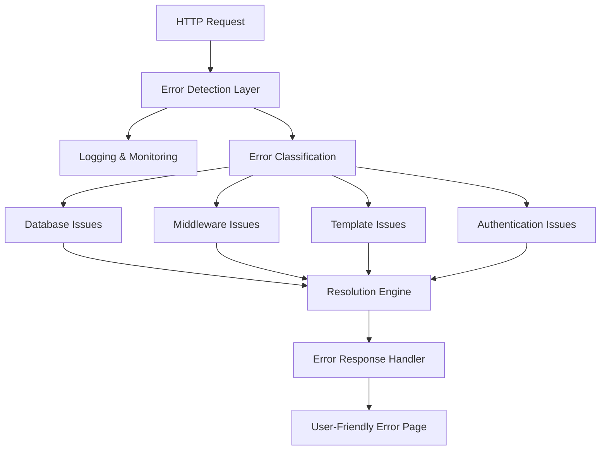

# Design Document

## Overview

The application is experiencing 500 Internal Server Errors on critical endpoints, specifically `/dashboard/admin/usuarios/` and `/lojas/`. Based on analysis of the codebase, the issues appear to stem from multiple potential causes:

1. **Middleware Chain Issues**: Complex middleware stack with authentication, session management, and store-specific logic
2. **Database Connection Problems**: Potential issues with database queries or missing migrations
3. **Template Rendering Errors**: Missing templates or context variables
4. **Import/Dependency Issues**: Missing imports or circular dependencies
5. **Authentication Flow Conflicts**: Complex authentication logic with multiple user types and dashboards

The design focuses on systematic diagnosis, robust error handling, and step-by-step resolution of these issues.

## Architecture

### Error Diagnosis Framework



### Current Middleware Stack Analysis

The application has a complex middleware chain:
1. `SecurityMiddleware`
2. `SessionMiddleware`
3. `CommonMiddleware`
4. `CsrfViewMiddleware`
5. `AuthenticationMiddleware`
6. `MessageMiddleware`
7. `ClickjackingMiddleware`
8. `ImprovedAuthenticationMiddleware` (Custom)
9. `PasswordChangeMiddleware` (Custom)
10. `LojaMiddleware` (Custom)
11. `ControleFinanceiroMiddleware` (Custom)

## Components and Interfaces

### 1. Enhanced Error Logging System

**Purpose**: Capture detailed error information for diagnosis

**Components**:
- `ErrorCaptureMiddleware`: Intercepts all exceptions and logs detailed information
- `DatabaseHealthChecker`: Monitors database connectivity and query performance
- `TemplateValidator`: Validates template existence and context variables
- `MiddlewareProfiler`: Profiles middleware execution time and errors

### 2. Middleware Debugging Tools

**Purpose**: Identify which middleware is causing failures

**Components**:
- `MiddlewareDebugger`: Wraps each middleware to catch and log exceptions
- `AuthenticationFlowTracker`: Tracks user authentication state through middleware chain
- `SessionValidator`: Validates session integrity and user permissions

### 3. Database Diagnostic System

**Purpose**: Identify and resolve database-related issues

**Components**:
- `MigrationChecker`: Verifies all migrations are applied
- `QueryAnalyzer`: Analyzes failing queries and suggests fixes
- `ConnectionPoolMonitor`: Monitors database connection health

### 4. Template and View Validator

**Purpose**: Ensure templates exist and views have proper context

**Components**:
- `TemplateExistenceChecker`: Validates template files exist
- `ContextValidator`: Ensures required context variables are present
- `ViewPermissionChecker`: Validates user permissions for views

## Data Models

### Error Tracking Models

```python
class ErrorLog(models.Model):
    timestamp = models.DateTimeField(auto_now_add=True)
    error_type = models.CharField(max_length=100)
    error_message = models.TextField()
    stack_trace = models.TextField()
    request_path = models.CharField(max_length=500)
    user = models.ForeignKey(User, null=True, blank=True)
    request_data = models.JSONField(default=dict)
    resolved = models.BooleanField(default=False)

class MiddlewareError(models.Model):
    error_log = models.ForeignKey(ErrorLog, on_delete=models.CASCADE)
    middleware_name = models.CharField(max_length=200)
    execution_order = models.IntegerField()
    execution_time = models.FloatField()
    
class DatabaseError(models.Model):
    error_log = models.ForeignKey(ErrorLog, on_delete=models.CASCADE)
    query = models.TextField()
    database_name = models.CharField(max_length=100)
    connection_status = models.CharField(max_length=50)
```

### Health Check Models

```python
class SystemHealth(models.Model):
    timestamp = models.DateTimeField(auto_now_add=True)
    database_status = models.CharField(max_length=20)
    middleware_status = models.CharField(max_length=20)
    template_status = models.CharField(max_length=20)
    overall_status = models.CharField(max_length=20)
```

## Error Handling

### 1. Graceful Degradation Strategy

- **Database Unavailable**: Show maintenance page with retry mechanism
- **Authentication Failure**: Clear session and redirect to login with error message
- **Template Missing**: Use fallback templates with basic functionality
- **Middleware Error**: Skip problematic middleware and log for later analysis

### 2. Error Response Hierarchy

```python
class ErrorResponseHandler:
    def handle_500_error(self, request, exception):
        # Log detailed error information
        # Determine error type and appropriate response
        # Return user-friendly error page
        
    def handle_database_error(self, request, exception):
        # Check database connectivity
        # Attempt reconnection
        # Show maintenance page if needed
        
    def handle_authentication_error(self, request, exception):
        # Clear corrupted session data
        # Redirect to appropriate login page
        # Log security-relevant information
```

### 3. Recovery Mechanisms

- **Automatic Migration Check**: Run pending migrations on startup
- **Session Cleanup**: Remove corrupted session data
- **Cache Invalidation**: Clear problematic cached data
- **Middleware Bypass**: Temporarily disable problematic middleware

## Testing Strategy

### 1. Error Reproduction Tests

```python
class ErrorReproductionTests(TestCase):
    def test_dashboard_admin_usuarios_500_error(self):
        # Reproduce the specific 500 error
        # Verify error logging captures details
        # Test recovery mechanisms
        
    def test_lojas_listing_500_error(self):
        # Reproduce the lojas listing error
        # Verify middleware chain execution
        # Test fallback responses
```

### 2. Middleware Integration Tests

```python
class MiddlewareIntegrationTests(TestCase):
    def test_middleware_chain_execution(self):
        # Test each middleware in isolation
        # Test middleware chain as a whole
        # Verify error handling in each middleware
        
    def test_authentication_flow(self):
        # Test different user types
        # Test session management
        # Test permission checking
```

### 3. Database Health Tests

```python
class DatabaseHealthTests(TestCase):
    def test_migration_status(self):
        # Verify all migrations are applied
        # Test migration rollback scenarios
        
    def test_query_performance(self):
        # Test critical queries
        # Identify slow queries
        # Test connection pooling
```

### 4. Load and Stress Tests

```python
class LoadTests(TestCase):
    def test_concurrent_requests(self):
        # Test multiple simultaneous requests
        # Verify no race conditions
        # Test session handling under load
        
    def test_memory_usage(self):
        # Monitor memory consumption
        # Test for memory leaks
        # Verify garbage collection
```

## Implementation Phases

### Phase 1: Error Capture and Logging
- Implement comprehensive error logging
- Add middleware debugging capabilities
- Create error dashboard for monitoring

### Phase 2: Database Diagnostics
- Implement database health checks
- Add migration verification
- Create query performance monitoring

### Phase 3: Authentication Flow Fixes
- Simplify authentication middleware
- Fix session management issues
- Resolve user permission conflicts

### Phase 4: Template and View Validation
- Verify all templates exist
- Fix missing context variables
- Implement fallback templates

### Phase 5: Performance Optimization
- Optimize database queries
- Reduce middleware overhead
- Implement caching strategies

### Phase 6: Monitoring and Alerting
- Set up real-time error monitoring
- Implement automated health checks
- Create alerting for critical issues